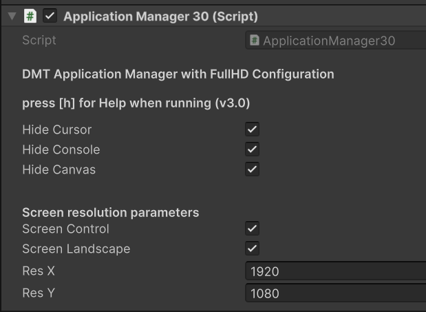

# Application Manager

Example with Unity, OpenCV and Face68 Detection. Nose and Mouth calculation. Including normalization with NDC (noramlized device coordinates).



## In-game Debug Console

Needs also the free In-game Debug Console: 
https://assetstore.unity.com/packages/tools/gui/in-game-debug-console-68068

## Info zum Application Manager

```
* ApplicationManager.cs (in empty GO ApplicationManager)
* Version 3.0 - with InfoCanvas, OpenCV, Uduino
* 
* author: Alexander Nischelwitzer, FH JOANNEUM, IMA, DMT, NIS
* last changed:21.11.2023
* 
* Use:
* Required: InGameDebug Console https://assetstore.unity.com/packages/tools/gui/in-game-debug-console-68068 
* Required: InfoCanvas - Infolayer for Data, Infos, OpenCV Cam, etc., pure Unity CANVAS
* Optional: Uduino https://assetstore.unity.com/packages/tools/input-management/uduino-arduino-communication-simple-fast-and-stable-78402
* 
* description:
* more App/System Infos
* Unity DMT Tools for general use, Config at start UP, etc.
* Screen Init, Startup Logging, Cursor On/Off, Window resize, etc.
* Design Pattern: Singleton  
* ButtonTools für Debugger, Exit, etc.
* 
* Features with public var
* 
* c ... Cursor On/Off
* f ... full screen to window toggle - default: full screen
* ! ... inGame DebugConsole - default: not shown
* r ... reset playerPrefs (delete) 
* i ... infos
* esc ... Quit
* 
* generale Features with IngameDebugConsole (always needed)
* https://assetstore.unity.com/packages/tools/gui/in-game-debug-console-68068
* 
*/
```

## DMT Static Store

Globaler Speicher um bei einen Scenenwechsel Daten zu übernehmen.


```
